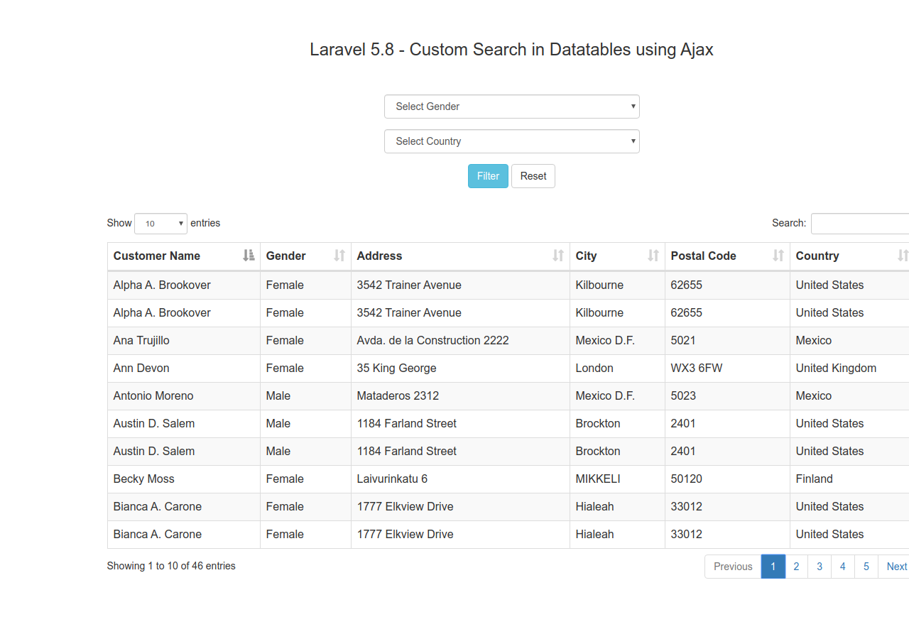

# Laravel 5.8 com Ajax

- Teste para Laravel Ajax
> Banco de Dados Postgresql

- https://www.webslesson.info/2019/07/implement-custom-search-filter-in-laravel-58-datatable-using-ajax.html
- http://localhost:8000/customsearch
> Rode php artisan migrate e import o sql(tbl_customer.sql)

- Renato Lucena
